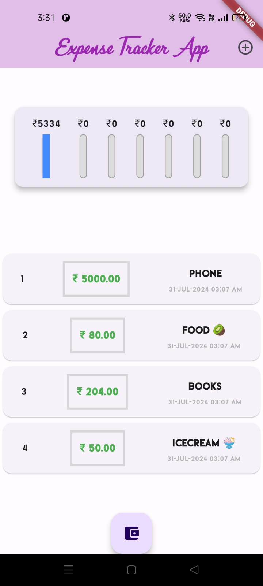
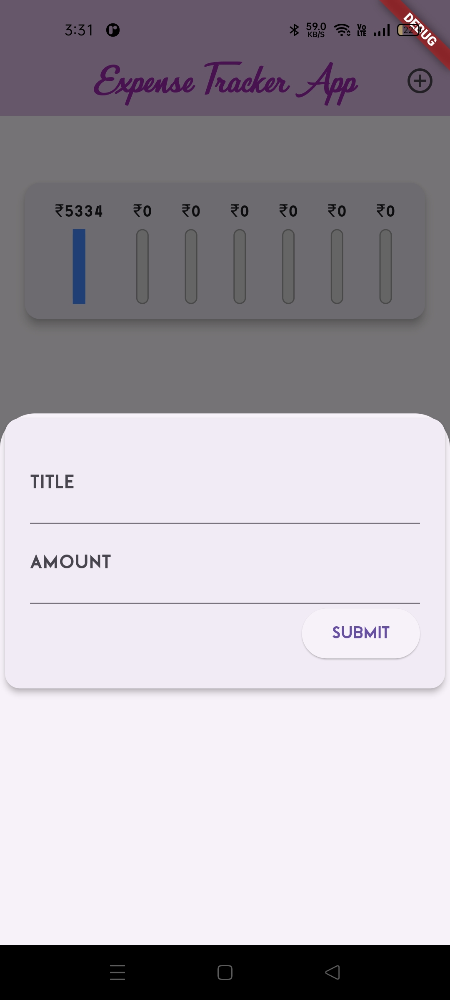

# Xpens - Personal Expense Tracker

## Overview

The **Xpens** is a Flutter-based application designed to help you keep track of your daily transactions and visualize your spending over the last 7 days. It's simple, user-friendly, and helps you stay on top of your finances.

## Features

- **Add Transactions**: Easily add your income and expense transactions with a few taps.
- **Last 7 Days Chart**: Visualize your spending over the last 7 days with an interactive chart.
- **Categorization**: Categorize your transactions for better insights.
- **Responsive Design**: Enjoy a seamless experience across different devices.

## Screenshots




## Installation

To run this project locally, follow these steps:

1. **Clone the repository**
   ```bash
   git clone https://github.com/yourusername/personal-expense-tracker.git
   cd personal-expense-tracker
   ```
2. **Install dependencies and Run the app**
   ```bash
    flutter pub get
    flutter run
   ```

## Usage

1. Add Transactions: Click on the "+" button to add a new transaction. Enter the amount, description, and select a category.
2. View Transactions: The home screen lists all your transactions. Scroll to view more.
3. View Chart: Swipe to the chart tab to see a graphical representation of your expenses over the last 7 days.
